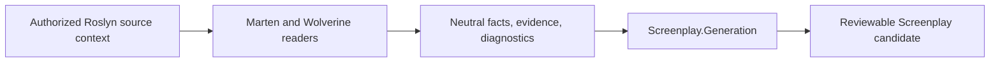

When a Marten or Wolverine convention is not represented, add the smallest bounded interpretation that the authored source proves. This case study shows how Screenplay.CritterStack applies the generic source-adapter model without moving framework-neutral responsibilities into this repository.

The canonical contract is [Build a .NET source adapter](/screenplay/generation/guides/build-source-adapter/). Read it first. Screenplay.Generation owns adapter composition, neutral facts, evidence, source identity, resolution, lowering, canonical printing, and compiler verification. This repository owns only Marten and Wolverine interpretation.



## Choose the framework owner

Put a new behavior in the reader that already owns its framework contract.

| Source concern | Current owner |
| --- | --- |
| Marten documents and identities | `MartenDocumentFacts` |
| Marten projections and configuration | `MartenFacts` and focused `Marten*Discovery` helpers |
| Marten event schema and tenancy | Focused event-schema and tenancy discovery helpers |
| Wolverine handlers and consequences | `WolverineFacts` |
| Wolverine discovery policy | `WolverineHandlerDiscovery` |
| Wolverine return slots | `WolverineReturnConsequences` |
| Wolverine sagas | `WolverineSagaFacts` |
| Framework-neutral Roslyn and source mechanics | Screenplay.Generation |

Create a focused discovery helper when a concern needs its own admission rules or diagnostic family. Keep the top-level readers as orchestration and neutral fact-emission boundaries. Do not add Screenplay syntax construction or lowering to this adapter.

## Match semantic framework identity

Record exact metadata names in `WellKnownTypes.cs`, then match bound Roslyn symbols.

- Use `OriginalDefinition` for generic contracts.
- Use `ReducedFrom` for extension methods.
- Walk interfaces or base types only when the framework contract defines inheritance.
- Require the host's authoritative authored-tree set before a declaration originates facts.
- Never match only a short method or attribute name.

The production adapter has no Marten or Wolverine runtime dependency. Metadata matching lets one adapter inspect the exercised framework generations without loading those runtime assemblies into the host.

For overloaded methods, use a full .NET documentation method identity. A short method name cannot distinguish overloads and must not become a subject or fact identifier.

## Admit the context before reading a body

A call has framework meaning only inside an admitted handler, endpoint, projection, subscription, listener, or configuration context. Prove that context first. Then inspect exact bound invocations and arguments within it.

A same-named call in unrelated source must contribute nothing. If Roslyn cannot resolve an exact symbol, report or omit the unresolved behavior rather than using candidate symbols as authority.

## Classify each consequence independently

One handler can have several consequences. Keep tuple slots and body effects separate so one supported sibling is not lost because another is unknown.

- HTTP response
- persisted event
- event-stream append or start
- document store, update, or delete
- local cascade
- explicit publish or send
- delayed delivery
- side effect
- saga state
- storage action

Do not classify a source-authored wrapper, response, message, or document as an event merely because its type is local. `WolverineReturnConsequences` separates return slots; `WolverineFacts` emits only relationships established by the classified result.

When flow is unresolved, retain a conservative relationship only if the framework contract still proves it. Otherwise emit a diagnostic and omit the guess.

## Keep evidence contributions independent

Marten and Wolverine can describe the same source subject. Give compatible observations the same stable subject identity and let Generation merge them. Do not call one framework reader from another to manufacture precedence, and do not let reader order select semantics.

Use evidence strength deliberately:

| Strength | Use |
| --- | --- |
| Exact | Bound invocation, attribute, interface, override, or return type |
| Configured | Authored framework registration or configuration |
| Conventional | Documented convention after exact admission |
| Heuristic | Display or placement suggestion only |

Equally strong incompatible facts must remain visible conflicts. Heuristic evidence must not establish persistence, stream ownership, authorization, or another correctness-critical role.

## Report bounded loss

Allocate a stable diagnostic code in the owning framework catalog. Include the severity, outcome, affected subject, authored source location, and a message that distinguishes what was observed from what was not represented.

Use presence-only diagnostics for custom policies, listeners, middleware, and other unbounded extension bodies. Do not interpret arbitrary extension code to suppress a warning. Hosts must display diagnostics even when generation has no error diagnostics.

## Add focused specifications

Give each behavior a minimal authored-source scenario and a corresponding analysis specification. Prove:

1. the framework stub and application compile;
2. exact artifacts and relationships;
3. optional, collection, and discriminator metadata where relevant;
4. close lookalikes do not match;
5. unsupported or unresolved source reports the exact code and outcome;
6. events, messages, responses, and documents are not conflated;
7. unrelated facts and diagnostics are absent; and
8. overloads and reversed input order remain deterministic.

Keep framework stubs local to the scenario. A shared fake framework couples unrelated specifications and can hide accidental assumptions.

## Check exercised compatibility

Use pinned public Marten and Wolverine samples for package-level compatibility. Use purpose-built authored-source fixtures for bounded positive and negative semantic cases. Do not import private source or create fixture names and content derived from a product.

Compatibility checks should pin semantic assertions as well as source hashes. Generate twice and compare the resulting bytes. Treat the resulting matrix as evidence for the exact exercised versions, not as an open-ended support guarantee.

## Run the repository gates

```shell
dotnet test Screenplay.CritterStack.slnx --configuration Debug
dotnet build Screenplay.CritterStack.slnx --configuration Release -p:Version=9999.0.0
dotnet pack Screenplay.CritterStack.slnx --no-build --configuration Release \
  -o Artifacts/NuGet -p:Version=9999.0.0
./scripts/verify-package-consumer.sh 9999.0.0 Artifacts/NuGet
```

The pinned compatibility matrix is defined by `.github/workflows/canonical-samples.yml`. Review every generated-source change before accepting an expectation update.

## Stop at the ownership boundary

An adapter contribution ends with neutral facts, evidence, and diagnostics. Screenplay.Generation resolves and lowers those contributions. The host owns workspace evaluation, provider admission, output, and publication.

This adapter does not prove automatic migration, runtime equivalence, Studio workflow integration, Stage execution, or production support. A separate rendering target must follow the canonical [Stage renderer-target guide](/screenplay/stage/guides/build-renderer-target/). If a proposed change needs one of those claims, it requires independent accepted evidence outside this case study.
